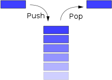

# Introduction

Lua（「LUA」という表記は正しくありません）は、強力で、高速で、軽量で、埋め込み可能なプログラミング言語です。多くのフレームワーク、ゲーム、その他のアプリケーションで使用されています。単独で使用することもできますが、他のアプリケーションに簡単に組み込むことができるように設計されています。これは、非常に移植性の高いCプログラミング言語のサブセットであるANSI Cで実装されています。つまり、他のほとんどのスクリプト言語では実行できない多くのシステムやデバイスで実行できます。この本の目的は、以前のプログラミング経験に関係なく、誰にでもLuaプログラミングを教えることです。この本は、プログラミングの紹介として、これまでプログラミングしたことがない人のために、またはLuaの紹介として、他の言語でのプログラミング経験のある人のために使用できます。Luaを使用する開発プラットフォームやゲームはたくさんあるので、この本はLuaの使い方を学び、その開発プラットフォームでそれを使用するためにも使用できます。

この本は、Luaの最新バージョンの使用法を教えることを目的としています。これは、Luaの新しいバージョンがリリースされると、定期的に更新が試みられることを意味します（Luaのリリースはそれほど頻繁ではないため、それほど難しくはありません）。現在、この本は以前のバージョンであるLua5.2の最新版です。5.xブランチ（Lua5.0およびLua5.1）で古いバージョンのLuaを使用する組み込み環境でLuaを使用している場合でも、資料は十分に関連しているはずです。

Luaは、ブラジル Rio de Janeiro にあるPontifical Catholic Universityで設計および保守されています。作成者は、 Roberto Ierusalimschy,、Waldemar Celes 、Luiz Henrique de Figueiredoです。

Lua (not "LUA", which is incorrect although common) is a powerful, fast, lightweight and embeddable programming language. It is used by many frameworks, games and other applications. While it can be used by itself, it has been designed to be easy to embed in another application. It is implemented in ANSI C, a subset of the C programming language that is very portable, which means it can run on many systems and many devices where most other scripting languages would not be able to run. The purpose of this book is to teach Lua programming to anyone regardless of previous programming experience. The book can be used as an introduction to programming, for someone who has never programmed before, or as an introduction to Lua, for people who have programmed before but not in Lua. Since there are many development platforms and games that use Lua, this book can also be used to learn to use Lua and then to use it in that development platform.

This book aims to teach usage of the latest version of Lua. This means it will be attempted to regularly update it as new versions of Lua come out (Lua releases are infrequent enough that this should not be too difficult). Currently, the book is up-to-date for Lua 5.2, which is the previous version. If you are using Lua in an embedded environment that uses an older version of Lua in the 5.x branch (Lua 5.0 and Lua 5.1), the material should still be sufficiently relevant for you.

Lua was designed and is being maintained at the Pontifical Catholic University of Rio de Janeiro, which is located in Brazil. Its creators are Roberto Ierusalimschy, Waldemar Celes and Luiz Henrique de Figueiredo.

> 「ルア」（LOO-ahと発音）はポルトガル語で「月」を意味します。そのため、頭字語でも略語でもありませんが、名詞です。より具体的には、「ルア」は名前、地球の月の名前、そして言語の名前です。ほとんどの名前と同様に、小文字で最初の大文字、つまり「Lua」を使用して記述する必要があります。醜くて紛らわしい「LUA」とは書かないでください。人によって意味が異なる頭字語になります。だから、「Lua」と書いてください！
>
> —Luaの作者、[Luaについて](http://www.lua.org/about.html)

> "Lua" (pronounced LOO-ah) means "Moon" in Portuguese. As such, it is neither an acronym nor an abbreviation, but a noun. More specifically, "Lua" is a name, the name of the Earth's moon and the name of the language. Like most names, it should be written in lower case with an initial capital, that is, "Lua". Please do not write it as "LUA", which is both ugly and confusing, because then it becomes an acronym with different meanings for different people. So, please, write "Lua" right!
>
> —Lua authors, [About Lua](http://www.lua.org/about.html)

Luaは、TeCGraf（リオデジャネイロのポンティフィカルカトリック大学の研究所）によって設計された2つの言語、DELとSolに由来します。 DELは「データ入力言語」を意味し、Solは「単純なオブジェクト言語」を意味し、ポルトガル語で太陽も意味します。そのため、ポルトガル語で「月」を意味するため、Luaという名前が選ばれました。ブラジルの石油会社であるPetrobrasのために作成されましたが、TeCGrafの他の多くのプロジェクトでも使用され、現在では世界中の多数のプロジェクトで使用されています。 Luaは、組み込みゲーム開発の分野における主要な言語の1つです。

Luaの主な利点の1つは、そのシンプルさです。一部の企業は、その利点のためだけにそれを使用しています。プログラミング言語を使用して特定のタスクを実行できれば、従業員はよりよく働くことができると考えていますが、複雑なプログラミング言語のフルコースを従業員に提供する余裕はありません。ここでのBashやBatchのようないくつかの非常に単純な言語は、これらのタスクを実行するのに十分強力ではありませんが、Luaは強力で単純です。 Luaのもう1つの重要な利点は、組み込み機能です。これは、開発全体を通じて最も重要な特性の1つでした。 World of WarcraftやROBLOXのようなゲームは、ユーザーが使用できるように、アプリケーションにLuaを埋め込むことができる必要があります。

プログラミングは、組み込みアプリケーション内で実行されるプログラムの場合はスクリプトとも呼ばれ、コンピュータープログラムを作成するプロセスです。プログラミング言語は、コンピュータープログラムに含まれているコンピューターコードを介してコンピューターに指示を与えるために使用される言語です。プログラミング言語は、英語の文法に似た構文と、言語で提供される基本関数であるライブラリの2つで構成されています。これらのライブラリは、英語の語彙と比較できます。

Lua comes from two languages that were designed by TeCGraf (a laboratory at the Pontifical Catholic University of Rio de Janeiro): DEL and Sol. DEL means "data entry language", while Sol means "simple object language" and also means sun in Portuguese, which is why the name Lua was chosen, since it means "moon" in Portuguese. It was created for Petrobras, a Brazilian oil company, but was also used in many other projects in TeCGraf, and is now used in a multitude of projects world-wide. Lua is one of the leading languages in the field of embedded game development.

One of the main advantages of Lua is its simplicity. Some companies use it exclusively because of that advantage: they think their employees would be able to work better if they could use a programming language to perform certain tasks, but they cannot afford to give to their employees a full course on a complicated programming language. Some very simple languages like Bash or Batch here would not be powerful enough to perform these tasks, but Lua is both powerful and simple. Another of the important advantages of Lua is its capability to be embedded, which was one of the most important characteristics of it throughout all of its development. Games like or World of Warcraft or ROBLOX need to be able to embed Lua in their application so users of the application can use it.

Programming, which is also sometimes called scripting in the case of programs that run inside embedded applications, is the process of writing computer programs. A programming language is a language used to give instructions to a computer through computer code that is contained in a computer program. A programming language consists of two things: a syntax, which is like grammar in English, and libraries, basic functions provided with the language. These libraries could be compared with vocabulary in English.

## Hello, world

Luaは、アプリケーションに埋め込まれて使用することも、単独で使用することもできます。この本では、Luaをコンピューターにインストールするプロセスについては説明していませんが、[codepad](http://codepad.org/)または[the Lua demo](http://www.lua.org/demo.html)を使用してコードを実行できます。この本のLuaコードの最初の例は、基本的で伝統的なhelloworldプログラムです。

> **「Hello World」のプログラムは、**表示装置に「Hello world」出力するコンピュータプログラムです。これは通常、ほとんどのプログラミング言語で可能な最も単純なプログラムの1つであるため、プログラミング言語の最も基本的な構文を初心者に説明したり、言語またはシステムが正しく動作していることを確認したりするためによく使用されます。
>
> —ウィキペディア、[Hello world program](https://en.wikipedia.org/wiki/Hello_world_program)

Lua can either be used embedded in an application or by itself. This book will not describe the process to install Lua on your computer, but you can execute code using [codepad](http://codepad.org/) or [the Lua demo](http://www.lua.org/demo.html). The first example of Lua code in this book will be the basic and traditional hello world program.

> A **"Hello world" program** is a computer program that outputs "Hello, world" on a display device. Because it is typically one of the simplest programs possible in most programming languages, it is by tradition often used to illustrate to beginners the most basic syntax of a programming language, or to verify that a language or system is operating correctly.
>
> —Wikipedia, [Hello world program](https://en.wikipedia.org/wiki/Hello_world_program)

```lua
print("Hello, world!")
```

上記のコードは、Hello, world! というテキストを出力します。紙に何かを印刷するのではなく、出力にテキストを表示することを参照して印刷します。これは、`print`という関数を呼び出すことによって引数として文字列"Hello, world!"を使用して行われます。これについては、関数に関する章で説明します。

Luaはほとんどの場合、低レベルのアプリケーションに[埋め込まれ](https://translate.googleusercontent.com/translate_c?depth=1&pto=aue&rurl=translate.google.com&sl=en&sp=nmt4&tl=ja&u=https://en.wikipedia.org/wiki/Embedded_system&usg=ALkJrhjO7IDN0JceQxPpd_cx_j0Qs56Ktg)ていることに注意してください。つまり、`print`関数は、ユーザーに表示される領域にテキストを常に表示するとは限りません。これらのアプリケーションのプログラミングインターフェイスのドキュメントでは、一般に、テキストをユーザーに表示する方法について説明します。

The code above prints the text Hello, world! to the output, printing referring to displaying text in the output, not to printing something on paper. It does so by calling the `print` function with the string "Hello, world!" as an argument. This will be explained in the chapter about functions.

Note that Lua is most of the time [embedded](https://en.wikipedia.org/wiki/Embedded_system) in a lower level application, which means that the `print` function will not always display text in an area that is visible to the user. The documentation of the programming interface of these applications will generally explain how text may be displayed to users.

## Comments

コメントは、プログラミング言語によって無視されるコード注釈です。コメントは、1行または複数行のコードの説明、プログラムの文書化、コードの一時的な無効化、またはその他の理由で使用できます。Luaが認識できるようにするには、接頭辞として2つのハイフン`--`を付ける必要があり、独自の行または別の行の末尾に配置できます。

A comment is a code annotation that is ignored by the programming language. Comments can be used to describe one or many lines of code, to document a program, to temporarily disable code, or for any other reason. They need to be prefixed by two hyphens to be recognized by Lua and they can be put either on their own line or at the end of another line:

```lua
print("This is normal code.")
-- This is a comment
print("This is still normal code.") -- This is a comment at the end of a line of code.
```

これらのコメントはショートコメントと呼ばれます。長い括弧`--[[`で始まり、多くの行に続く長いコメントを作成することもできます。
These comments are called short comments. It is also possible to create long comments, which start with a long bracket and can continue on many lines:

```lua
print("This is normal code")
--[[Line 1
Line 2
]]
```

長い角かっこは2つの角かっこ `[[ ` で 構成され、その中央に任意の数の等号 `=`を付けることができます。その等号の数は、長い括弧のレベルと呼ばれます。長い角かっこは、同じレベルの次の角かっこがあるところまで続きます。等号のない長い角かっこは、レベル0の長い角かっこと呼ばれます。このアプローチでは、2つの角かっこの中央に等号を追加することにより、長いコメントの内側で閉じている二重角かっこを使用できます。コメントを使用してコードのブロックを無効にする場合は、これを行うと便利なことがよくあります。

Long brackets consist of two brackets in the middle of which any number of equality signs may be put. That number is called the level of the long bracket. Long brackets will continue until the next bracket of the same level, if there is one. A long bracket with no equal sign is called a long bracket of level 0. This approach makes it possible to use closing double brackets inside of long comments by adding equal signs in the middle of the two brackets. It is often useful to do this when using comments to disable blocks of code.

```lua
--[==[
This is a comment that contains a closing long bracket of level 0 which is here: ]]
However, the closing double bracket doesn't make the comment end, because the comment was opened with an opening long bracket of level 2, and only a closing long bracket of level 2 can close it.
]==]
```

上記の例では、レベル0の閉じている長い括弧（`]]`）はコメントを閉じませんが、レベル2の閉じている長い括弧（`]==]`）で閉じます。

In the example above, the closing long bracket of level 0 (`]]`) does not close the comment, but the closing long bracket of level 2 (`]==]`) does.

## Syntax

プログラミング言語の構文は、文法が文や単語の書き方を定義するのと同じように、ステートメントや式をそのプログラミング言語で書く方法を定義します。文と表現はそれぞれ文と単語と比較することができます。式は、値を持ち、評価できるコードの断片です。一方、ステートメントは、実行可能で、命令とその命令を使用する1つまたは複数の式を含むコードの断片です。たとえば、`3 + 5`は式であり、`variable = 3 + 5` はその式の値を変数に設定するステートメントです。

The syntax of a programming language defines how statements and expressions must be written in that programming language, just like grammar defines how sentences and words must be written. Statements and expressions can be respectively compared to sentences and words. Expressions are pieces of code that have a value and that can be evaluated, while statements are pieces of code that can be executed and that contain an instruction and one or many expressions to use that instruction with. For example, `3 + 5` is an expression and `variable = 3 + 5` is a statement that sets the value of variable to that expression.

Luaの構文全体は、[Lua Webサイト](https://translate.googleusercontent.com/translate_c?depth=1&pto=aue&rurl=translate.google.com&sl=en&sp=nmt4&tl=ja&u=http://www.lua.org/manual/5.1/manual.html&usg=ALkJrhj_HxYENqimSypV-FZTjPomzfmbbA#8)の拡張バッカスナウア記法で見つけることができますが、それを読んでも何も理解できません。[拡張バッカスナウア記法](https://translate.googleusercontent.com/translate_c?depth=1&pto=aue&rurl=translate.google.com&sl=en&sp=nmt4&tl=ja&u=https://en.wikipedia.org/wiki/Extended_Backus%E2%80%93Naur_Form&usg=ALkJrhhZ5MEl-WEm6LiP6u5gH88OH4qsCg)はメタ言語であり、メタウェブサイトがウェブサイトに関するウェブサイトであるように、別の言語を説明するために使用される言語であり、Luaではメタテーブルが他のテーブルの動作を定義するテーブルです（この本の後半のメタテーブルとテーブルについてで学習します））。ただし、この本では、拡張バッカスナウア記法を学ぶ必要はありません。Luaのような言語はメタ言語を使用して説明できますが、単語や文を使用して英語で説明することもできます。これはまさに、この本がしていることです。

The entire syntax of Lua can be found in extended Backus–Naur form [on the Lua website](http://www.lua.org/manual/5.1/manual.html#8), but you wouldn't understand anything if you read it. [Extended Backus–Naur Form](https://en.wikipedia.org/wiki/Extended_Backus–Naur_Form) is a metalanguage, a language used to describe another language, just like a metawebsite is a website about a website, and just like metatables, in Lua, are tables that define the behavior of other tables (you'll learn about metatables and tables later in this book). But you're not going to have to learn extended Backus–Naur form in this book, because, while a language like Lua can be described using a metalanguage, it can also be described using words and sentences, in English, and this is exactly what this book is going to do.

英語は別の言語を説明するために使用できるため、それ自体がメタ言語である必要があります（メタ言語の定義に対応しているため）。これは確かに事実です。また、プログラミング言語の目的は命令を記述することであり、英語でそれを行うことができるため、英語もプログラミング言語である必要があります。これは**、ある意味で**、そうです。実際、英語は多くのことに使用できる言語です。ただし、拡張バッカスナウア記法は特殊言語であり、プログラミング言語も特殊言語です。専門化は、特定のことを行うのは非常に得意であるが、他のことを行うことができないという特徴です。拡張バッカスナウア記法は他の言語の記述に非常に優れていますが、指示を書いたりメッセージを伝えたりするために使用することはできません。プログラミング言語は指示を与えるのに非常に優れていますが、言語の記述やメッセージの伝達には使用できません。

英語は、言語の説明、指示の提供、メッセージの伝達など、すべてを行うことができます。しかし、プログラミング言語と同等のことはあまり得意ではありません。実際、英語では指示を与えるのは非常に苦手なので、コンピューターに指示を与えるために使用された場合、コンピューターは何も理解しません。これは、コンピューターが非常に正確で明確な指示を必要とするためです。

Since English can be used to describe another language, then it must itself be a metalanguage (because it corresponds to the definition of a metalanguage). This is indeed the case. And since the purpose of a programming language is to describe instructions, and you can do that with English, English must also be a programming language. This, **in a way**, is also the case. In fact, English is a language that can be used for many things. But extended Backus–Naur form is a specialized language, and programming languages are also specialized languages. Specialization is the characteristic of being very good at doing something in particular, but not being capable of doing other things. Extended Backus–Naur form is very good at describing other languages, but it cannot be used to write instructions or to communicate a message. Programming languages are very good at giving instructions, but they cannot be used to describe languages or to communicate messages.

English is capable of doing everything: describing languages, giving instructions and communicating messages. But it is not very good at doing some of these. In fact, it is so bad at giving instructions that, if it is used to give instructions to a computer, the computer won't understand anything. That's because computers need the instructions to be very precise and unambiguous.

## Obtaining Lua

Luaは、Luaの公式Webサイトの[ダウンロードページ](http://www.lua.org/download.html)から入手できます。手順もそこにあります。ダウンロードボタンはソースコード用ですが、おそらくあなたが望むものではありません。おそらくバイナリを探しているので、ページを見てそれらに関する情報を見つける必要があります（使用しているプラットフォームによって異なります）。この本の目的は、Lua言語を教えることだけであり、Luaツールの使用法を教えることではありません。この本では読者は組み込み環境でLuaを使用すると想定れていますが、必ずしもそのとおりであるわけではありません。それは、この本の中では、Luaの使用法をスタンドアロン言語として説明していないことを意味するだけです。 

Lua can be obtained on the official Lua website, [on the download page](http://www.lua.org/download.html). Instructions are also available there: the download button is for the source code, which is probably not what you want. You are probably looking for binaries, so you should look around the page to find information about those (what exactly you are looking for depends on the platform you are using). The purpose of this book is only to teach the Lua language, not to teach usage of the Lua tools. It is generally assumed that the reader will be using Lua in an embedded environment, but this does not need to be the case for the book to be useful, only does it mean that the book will not describe the usage of Lua as a standalone language.

## Quiz

この章の内容を理解したことを確認するために質問がいくつかあります。これらの質問の対する答えを見つけるには、この章に記載されていない知識が必要になる場合があることに注意してださい。これは正常なことです。クイズは学習体験の一部であり、本の他の場所では入手できない情報を紹介することができます。

There are some questions you can answer to verify that you have understood the material in this chapter. Note that finding the answer to some of those questions could require having knowledge that is not presented in this chapter. This is normal: the quizzes are part of the learning experience, and they can introduce information that is not available elsewhere in the book.


**1**　ポルトガル語で「ルア」とはどういう意味ですか？What does "Lua" mean in Portuguese?


**2**　レベル0の長いコメントはどれですか？Which of these is a long comment of level 0?

|      | 選択肢             |
| ---- | ------------------ |
|      | `--Comment `       |
|      | `[[Comment]] `     |
|      | `--[[Comment]] `   |
|      | `--[=[Comment]=] ` |
|      | `[=[Comment]=] `   |

**3**　拡張バッカスナウア記法とは何ですか？What is extended Backus–Naur form?

|      | 選択肢                           |
| ---- | -------------------------------- |
|      | A language                       |
|      | A programming language           |
|      | A natural (or ordinary) language |
|      | A notation                       |
|      | A metalanguage                   |
|      | A markup language                |

# Expressions

前に説明したように、式は値を持ち、評価できるコードの断片です。これらは（関数呼び出しを除いて）直接実行できないため、式で構成される次のコードのみを含むスクリプトはエラーになります。

As explained before, expressions are pieces of code that have a value and that can be evaluated. They cannot be executed directly (with the exception of function calls), and thus, a script that would contain only the following code, which consists of an expression, would be erroneous:

```lua
3 + 5
-- The code above is erroneous because all it contains is an expression.
-- The computer cannot execute '3 + 5', since that does not make sense.
```

コードは一連のステートメントで構成されている必要があります。これらのステートメントには、ステートメントが命令を実行するために操作または使用する必要のある値となる式を含めることができます。

この章の一部のコード例は、式のみで構成されているため、有効なコードを構成していません。次の章では、ステートメントについて説明し、有効なコードの記述を開始できるようにします。

Code must be comprised of a sequence of statements. These statements can contain expressions which will be values the statement has to manipulate or use to execute the instruction.

Some code examples in this chapter do not constitute valid code, because they consist of only expressions. In the next chapter, statements will be covered and it will be possible to start writing valid code.

## Types

式を評価することは、式を計算してその値を見つけることです。特定の式が評価する値は、環境とスタックレベルに依存する可能性があるため、コンテキストごとに異なる場合があります。この値は、数値、テキスト、その他の多くのデータ型のいずれかになる場合があります。そのため、型があると言われます。

Luaおよび一般的なプログラミングでは、式は通常、0個以上の演算子を持つ1つ以上の値で構成されます。一部の演算子は、一部のタイプでのみ使用できます（たとえば、テキストを分割しようとするのは非論理的ですが、数値を分割することは理にかなっています）。演算子には、単項演算子と二項演算子の2種類があります。単項演算子は、1つの値のみを取る演算子です。たとえば、単項演算子は、パラメータとして-5、-3、-6などの1つの数値のみを取ります。パラメータとして1つの数値を取り、その数値を無効にします。ただし、同じ演算子ではない2項演算子は、2つの値を取り、最初の値から2番目の値を減算します：5-3、8-6、4-9など。

To evaluate an expression is to compute it to find its value. The value a given expression evaluates to might be different from one context to another, since it can depend on the environment and stack level. This value will sometimes be a number, sometimes text and the other times any of many other data types, which is why it is said to have a type.

In Lua, and in programming in general, expressions will usually consist of one or more values with zero or more operators. Some operators can only be used with some types (it would be illogical, for example, to try to divide text, while it makes sense to divide numbers). There are two kinds of operators: unary operators and binary operators. Unary operators are operators that only take one value. For example, the unary - operator only takes one number as a parameter: -5, -3, -6, etc. It takes one number as a parameter and negates that number. The binary - operator, however, which is not the same operator, takes two values and subtracts the second from the first: 5 - 3, 8 - 6, 4 - 9, etc.

`type`関数を使用して、数値の型を文字列として取得することができます。

It is possible to obtain a number's type as a string with the `type` function:

```lua
print(type(32425)) --> number
```

### Numbers

数字は一般的に数量を表しますが、他の多くのことに使用できます。Luaの数値型は、実数とほとんど同じように機能します。数値は、整数、10進数、10進数の指数、または[16進数](https://en.wikipedia.org/wiki/hexadecimal)で構成できます。有効な番号は次のとおりです。

Numbers generally represent quantities, but they can be used for many other things. The number type in Lua works mostly in the same way as real numbers. Numbers can be constructed as integers, decimal numbers, decimal exponents or even in [hexadecimal](https://en.wikipedia.org/wiki/hexadecimal). Here are some valid numbers:

- 3
- 3.0
- 3.1416
- 314.16e-2
- 0.31416E1
- 0xff
- 0x56

#### Arithmetic operations

Luaの数値の演算子は次のとおりです。

The operators for numbers in Lua are the following:

| 操作         | 構文  | 説明                                         | 例        |
| ------------ | ----- | -------------------------------------------- | --------- |
| 算術否定     | -a    | aの符号を変更し、値を返します                | -3.14159  |
| 添加         | a + b | aとbの合計を返します                         | 5.2 + 3.6 |
| 減算         | a-b   | aからbを減算し、結果を返します               | 6.7-1.2   |
| 乗算         | a * b | aとbの積を返します                           | 3.2 * 1.5 |
| べき乗       | a ^ b | aをbの累乗、またはaのbによるべき乗に返します | 5 ^ 2     |
| 分割         | a / b | aをbで除算し、結果を返します                 | 6.4 / 2   |
| モジュロ演算 | a％b  | aをbで割った余りを返します                   | 5％3      |

| Operation           | Syntax | Description                                               | Example   |
| ------------------- | ------ | --------------------------------------------------------- | --------- |
| Arithmetic negation | -a     | Changes the sign of a and returns the value               | -3.14159  |
| Addition            | a + b  | Returns the sum of a and b                                | 5.2 + 3.6 |
| Subtraction         | a - b  | Subtracts b from a and returns the result                 | 6.7 - 1.2 |
| Multiplication      | a * b  | Returns the product of a and b                            | 3.2 * 1.5 |
| Exponentiation      | a ^ b  | Returns a to the power b, or the exponentiation of a by b | 5 ^ 2     |
| Division            | a / b  | Divides a by b and returns the result                     | 6.4 / 2   |
| Modulo operation    | a % b  | Returns the remainder of the division of a by b           | 5 % 3     |

最後のものを除いて、これらの演算子（基本的な数学演算子と同じ）はすべてすでに知っているでしょう。最後のものはモジュロ演算子と呼ばれ、ある数値を別の数値で除算した余りを単純に計算します。たとえば、5％3は、2が5を3で割った余りであるため、結果として2になります。モジュロ演算子は他の演算子ほど一般的ではありませんが、複数の用途があります。

You probably already know all of these operators (they are the same as basic mathematical operators) except the last. The last is called the modulo operator, and simply calculates the remainder of the division of one number by another. 5 % 3, for example, would give 2 as a result because 2 is the remainder of the division of 5 by 3. The modulo operator is less common than the other operators, but it has multiple uses.

#### Integers

数値の新しいサブタイプである整数がLua5.3で追加されました。数値は整数または浮動小数点数のいずれかです。浮動小数点数は上記の数値に似ていますが、整数は小数部のない数値です。浮動小数点の除算（`/`）とべき乗は、常にオペランドを浮動小数点数に変換しますが、他のすべての演算子は、2つのオペランドが整数の場合、整数を返します。その他の場合、フロア分割演算子（`//`）を除いて、結果はフロートになります。

A new subtype of numbers, integers, was added in Lua 5.3. Numbers can be either integers or floats. Floats are similar to numbers as described above, while integers are numbers with no decimal part. Float division (`/`) and exponentiation always convert their operands to floats, while all other operators give integers if their two operands were integers. In other cases, with the exception of the floor division operator (`//`), the result is a float.

### Nil

Nilは値 nilのタイプであり、その主なプロパティは他の値とは異なります。これは通常、有用な値がないことを表します。nilを値に持つものの例：

Nil is the type of the value nil, whose main property is to be different from any other value; it usually represents the absence of a useful value. Some examples of things that have the value nil:

- 値を割り当てる前にアクセスする変数の値
- スコープ外の変数にアクセスしようとしたときに取得する値
- 割り当てられていないテーブル内のキーの値
- `tonumber`によって文字列を数値に変換できない場合に返される値

- value of variables that you access before assigning them a value
- value you get when trying to access a variable outside of its scope
- value for any key in a table that hasn't been assigned
- value returned by `tonumber` if it can't convert a string to a number

より高度な注意点として、意図的にnil値を割り当てると、変数またはテーブルへの参照が削除され、[ガベージコレクター](https://en.m.wikibooks.org/w/index.php?title=Garbage_collection&action=edit&redlink=1)がそのメモリを再利用できるようになります。

On a more advanced note, purposefully assigning a nil value removes the reference to a variable or table, and allows the [garbage collector](https://en.m.wikibooks.org/w/index.php?title=Garbage_collection&action=edit&redlink=1) to reclaim its memory.

### Booleans

ブール値は true または false のいずれかになりますが、それ以外はありません。これは、予約キーワードである`true`と`false`としてLuaで記述されています。注意すべき重要な点は、これは前述`nil`のように異なるデータ型であるということです。`and`、`or`、`not()`　は通常ブール値と関連していますが、Luaの任意のデータ型で使用することができます。

A boolean value can be either true or false, but nothing else. This is written in Lua as `true` and `false`, which are reserved keywords. Important to note is that `nil` is a different data type as stated earlier. `and`, `or`, `not()` are usually associated with boolean values, but can be used with any datatype in Lua.

| 操作       | 構文    | 説明                                                         |
| ---------- | ------- | ------------------------------------------------------------ |
| ブール否定 | not a   | aがfalseまたはnilの場合、trueを返します。それ以外の場合は、falseを返します。 |
| 論理積     | a and b | falseまたはnilの場合、最初の引数を返します。それ以外の場合は、2番目の引数を返します。 |
| 論理和     | a or b  | falseでもnilでもない場合、最初の引数を返します。それ以外の場合は、2番目の引数を返します。 |

| Operation           | Syntax  | Description                                                  |
| ------------------- | ------- | ------------------------------------------------------------ |
| Boolean negation    | not a   | If a is false or nil, returns true. Otherwise, returns false. |
| Logical conjunction | a and b | Returns the first argument if it is false or nil. Otherwise, returns the second argument. |
| Logical disjunction | a or b  | Returns the first argument if it is neither false nor nil. Otherwise, returns the second argument. |

基本的に、`not`演算子はブール値を否定するだけで（trueの場合はfalseにし、falseの場合はtrueにします）、`and`演算子は両方がtrueの場合はtrueを返し、そうでない場合はfalseを返し、`or`演算子はいずれかの引数がtrueの場合はtrueを返します。それ以外の場合はfalse。ただし、上記の表で正確な動作方法が説明されているため、これは正確には動作しません。Luaでは、論理式では値falseとnilの両方がfalseと見なされ、その他はすべてtrueと見なされます（0と空の文字列も含む）。

次の章で紹介する関係演算子（`<`、`>`、`<=`、`>=`、`~=`、`==`）は必ずしもオペランドとしてブール値を取ることはありませんが、常に結果としてブール値が得られます。

これを調整するのは難しい場合があります。わかりやすくするために、ここにいくつかの真理値表または式と結果のペアを示します。ここで`x`は`nil`、`true`または`false`：

Essentially, the `not` operator just negates the boolean value (makes it false if it is true and makes it true if it is false), the `and` operator returns true if both are true and false if not and the `or` operator returns true if either of arguments is true and false otherwise. This is however not exactly how they work, as the exact way they work is explained in the table above. In Lua, the values false and nil are both considered to be false in logical expressions, while everything else is considered as true (even 0 and empty strings).

The relational operators introduced in the next chapter (`<`, `>`, `<=`, `>=`, `~=`, `==`) do not necessarily take boolean values as operands, but will always give a boolean value as a result.

This can be difficult to reconcile. For added clarity, here are some truth tables or expression-result pairs. Here `x` can be `nil`, `true` or `false`:

| 式            | 結果    |
| ------------- | ------- |
| `true and x`  | `x`     |
| `false and x` | `false` |
| `nil and x`   | `nil`   |
|               |         |
| `true or x`   | `true`  |
| `false or x`  | `x`     |
| `nil or x`    | `x`     |

これはやや直感に反することを意味します

This somewhat counterintuitively means that

| 式              | 結果    |
| --------------- | ------- |
| `false and nil` | `false` |
| `nil and false` | `nil`   |

加えて

In addition,

| 式                            | 結果    |
| ----------------------------- | ------- |
| `false == nil` `nil == false` | `false` |
| `nil and false`               | `nil`   |

| 式                      | 結果    |
| ----------------------- | ------- |
| `not(false)` `not(nil)` | `true ` |
| `not(true)`             | `false` |

### Strings

文字列は、テキストを表すために使用できる文字のシーケンスです。これらは、[コメントに関するセクションで]()前に説明した二重引用符、一重引用符、または長い角かっこで囲むことにより、Luaで記述でき[ます。コメントと文字列には、コメントの場合は2つのハイフンを前に付けて、両方を長い角かっこで区切ることができるという事実以外に共通点がないことに注意してください）。長い括弧に含まれていない文字列は、1行だけ続きます。このため、長い角かっこを使用せずに多くの行を含む文字列を作成する唯一の方法は、エスケープシーケンスを使用することです。これは、特定の場合に一重引用符または二重引用符を挿入する唯一の方法でもあります。エスケープシーケンスは、Luaでは常にバックスラッシュ（ ' \ ' ）であるエスケープ文字と、エスケープする文字を識別する識別子の2つで構成されます。

Strings are sequences of characters that can be used to represent text. They can be written in Lua by being contained in double quotes, single quotes or long brackets, which were covered before in [the section about comments](https://en.m.wikibooks.org/wiki/Lua_Programming/Introduction#Comments) (it should be noted that comments and strings have nothing in common other than the fact they can both be delimited by long brackets, preceded by two hyphens in the case of comments). Strings that aren't contained in long brackets will only continue for one line. Because of this, the only way to make a string that contains many lines without using long brackets is to use escape sequences. This is also the only way to insert single or double quotes in certain cases. Escape sequences consist of two things: an escape character, which will always be a backslash ('\') in Lua, and an identifier that identifies the character to be escaped.

| Escape sequence | Description                                                  |
| --------------- | ------------------------------------------------------------ |
| \n              | A new line                                                   |
| \"              | A double quote                                               |
| \'              | A single quote (or apostrophe)                               |
| \\              | A backslash                                                  |
| \t              | A horizontal tab                                             |
| \###            | ### must be a number from 0 to 255. The result will be the corresponding [ASCII](https://en.wikipedia.org/wiki/ASCII) character. |

Escape sequences are used when putting the character directly in the string would cause a problem. For example, if you have a string of text that is enclosed in double quotes and must contain double quotes, then you need to enclose the string in different characters or to escape the double quotes. Escaping characters in strings delimited by long brackets is not necessary, and this is true for all characters. All characters in a string delimited with long brackets will be taken as-is. The `%` character is used in string patterns to escape magic characters, but the term *escaping* is then used in another context.

```lua
"This is a valid string."

'This is also a valid string.'

"This is a valid \" string 'that contains unescaped single quotes and escaped double quotes."

[[
This is a line that can continue
on more than one line.

It can contain single quotes, double quotes and everything else (-- including comments). It ignores everything (including escape characters) except closing long brackets of the same level as the opening long bracket.
]]

"This is a valid string that contains tabs \t, double quotes \" and backlashes \\"

"This is " not a valid string because there is an unescaped double quote in the middle of it."
```

For convenience, if an opening long string bracket is immediately followed by a new line, that new line will be ignored. Therefore, the two following strings are equivalent:

```lua
[[This is a string
that can continue on many lines.]]

[[
This is a string
that can continue on many lines.]]

-- Since the opening long bracket of the second string is immediately followed by a new line, that new line is ignored.
```

It is possible to get the length of a string, as a number, by using the unary length operator ('#'):

```lua
print(#("This is a string")) --> 16
```

#### Concatenation

> In [formal language theory](https://en.wikipedia.org/wiki/formal_language) and [computer programming](https://en.wikipedia.org/wiki/computer_programming), **string concatenation** is the operation of joining two [character strings](https://en.wikipedia.org/wiki/character_string_(computer_science)) end-to-end. For example, the concatenation of "snow" and "ball" is "snowball".
>
> —Wikipedia, [Concatenation](https://en.wikipedia.org/wiki/Concatenation)

The string concatenation operator in Lua is denoted by two dots ('..'). Here is an example of concatenation that concatenates "snow" and "ball" and prints the result:

```lua
print("snow" .. "ball") --> snowball
```

This code will concatenate "snow" and "ball" and will print the result.

### Other types

The four basic types in Lua (numbers, booleans, nil and strings) have been described in the previous sections, but four types are missing: functions, tables, userdata and threads. Functions are pieces of code that can be called, receive values and return values back. Tables are data structures that can be used for data manipulation. Userdata are used internally by applications Lua is embedded in to allow Lua to communicate with that program through objects controlled by the application. Finally, threads are used by coroutines, which allow many functions to run at the same time. These will all be described later, so you only need to keep in mind that there are other data types.

## Literals

Literals are notations for representing fixed values in source code. All values can be represented as literals in Lua except threads and userdata. String literals (literals that evaluate to strings), for example, consist of the text that the string must represent enclosed into single quotes, double quotes or long brackets. Number literals, on the other hand, consist the number they represent expressed using decimal notation (ex: `12.43`), scientific notation (ex: `3.1416e-2` and `0.31416E1`) or hexadecimal notation (ex: `0xff`).

## Coercion

Coercion is the conversion of a value of one data type to a value of another data type. Lua provides automatic coercion between string and number values. Any arithmetic operation applied to a string will attempt to convert this string to a number. Conversely, whenever a string is expected and a number is used instead, the number will be converted to a string. This applies both to Lua operators and to default functions (functions that are provided with the language).

```lua
print("122" + 1) --> 123
print("The number is " .. 5 .. ".") --> The number is 5.
```

Coercion of numbers to strings and strings to numbers can also be done manually with the `tostring` and `tonumber` functions. The former accepts a number as an argument and converts it to a string, while the second accepts a string as an argument and converts it to a number (a different base than the default decimal one can optionally be given in the second argument).

## Bitwise operations

Since Lua 5.3, bitwise operators are provided to operate on binary numerals (bit patterns). These operators are not used as frequently as the others, so you may skip this section if you do not need them.

The bitwise operators in Lua always operate on integers, converting their operands if this is necessary. They also give integers.

The bitwise AND operation (with operator `&`) performs logical conjunction on each pair of bits of two binary representations of equal length. For example, `5 & 3` evaluates to 1. We can explain this by looking at the binary representation of these numbers (the subscripts are used to denote the base):


If the bits in a given position in the binary representation of both 5 and 3 are 1 (as is the case for the last bit), then the bit at that position will be 1 in the result; in all other cases, it will be 0.

The bitwise OR operation (with operator `|`) works in the same way as the bitwise AND, performing logical disjunction instead where it performs logical conjunction. Thus, `5 | 3` will evaluate to 7:


Here, we can see that the bit in each position in the final result was 0 only when the binary representations of the two operands had a 0-bit at that position.

The bitwise XOR operation (with operator `~`) works like two others, but at a given position, the final bit is only 1 if one, and not both, of the bits in the operands are 1.


This is the same as the previous example, but we can see that the last bit in the result is 0 instead of 1, since the last bit of both operands was 1.

The bitwise NOT operation (with operator `~`) performs logical negation on each bit of its unique operand, which means that each 0 becomes 1 and that each 1 becomes 0. Thusly, `~7` will evaluate to -8:


Here, the first bit became 1 in the result because it was 0 in the operand, and the other bits became 0 because they were all 1.

[](https://en.m.wikibooks.org/wiki/File:Rotate_left_logically.svg)[](https://en.m.wikibooks.org/wiki/File:Rotate_right_arithmetically.svg)

In addition to these bitwise operators, Lua 5.3 also supports arithmetic bit shifts. The left shift, with operator `<<` and illustrated on left, consists in shifting all bits to the left, by a number of bits that corresponds to the second operand. The right shift, denoted by operator `>>` and illustrated on right, does the same but in the opposite direction.

## Operator precedence

Operator precedence works the same way in Lua as it typically does in mathematics. Certain operators will be evaluated before others, and parentheses can be used to arbitrarily change the order in which operations should be executed. The priority in which operators are evaluated is in the list below, from higher to lower priority. Some of these operators were not discussed yet, but they will all be covered at some point in this book.

1. Exponentiation: `^`
2. Unary operators: `not`, `#`, `-`, `~`
3. Level 2 mathematical operators: `*`, `/`, `//`, `%`
4. Level 1 mathematical operators: `+`, `-`
5. Concatenation: `..`
6. Bit shifts: `<<`, `>>`
7. Bitwise AND: `&`
8. Bitwise XOR: `~`
9. Bitwise OR: `|`
10. Relational operators: `<`, `>`, `<=`, `>=`, `~=`, `==`
11. Boolean and: `and`
12. Boolean or: `or`

## Quiz

There are some questions you can answer to verify that you have understood the material in this chapter. Note that finding the answer to some of those questions could require having knowledge that is not presented in this chapter. This is normal: the quizzes are part of the learning experience, and they can introduce information that is not available elsewhere in the book.


**1**What will `print(type(type(5.2)))` output?


**2**What will the expression `0 or 8` return?

|      |          |
| ---- | -------- |
|      | `true `  |
|      | `false ` |
|      | `0 `     |
|      | `8 `     |

**3**Which strings are valid?

|      |                  |
| ---- | ---------------- |
|      | `"test's test"`  |
|      | `'test\'s test'` |
|      | `"test"s test"`  |
|      | `'test"s test'`  |
|      | `"test\'s test"` |
|      | `'test's test'`  |

**4**Which expressions give the string `"1223"`?

|      |               |
| ---- | ------------- |
|      | `"122" + 3`   |
|      | `"122" .. 3`  |
|      | `"12" + "23"` |
|      | `12 .. 23`    |

**5**True or false? `not 5^3 == 5`

|      |         |
| ---- | ------- |
|      | `true`  |
|      | `false` |

#  Statements

Statements are pieces of code that can be executed and that contain an instruction and expressions to use with it. Some statements will also contain code inside of themselves that may, for example, be run under certain conditions. Dissimilarly to expressions, they can be put directly in code and will execute. Lua has few instructions, but these instructions, combined with other instructions and with complex expressions, give a good amount of control and flexibility to the user.

## Assignment

Programmers frequently need to be able to store values in the memory to be able to use them later. This is done using variables. Variables are references to a value which is stored in the computer's memory. They can be used to access a number later after storing it in the memory. Assignment is the instruction that is used to assign a value to a variable. It consists of the name of the variable the value should be stored in, an equal sign, and the value that should be stored in the variable:

```lua
variable = 43
print(variable) --> 43
```

As demonstrated in the above code, the value of a variable can be accessed by putting the variable's name where the value should be accessed.

### The assignment operator

In Lua, as with most other programming languages, the equals sign (`=`) acts as a dyadic assignment operator assigning the value of the expression of the right hand operand to the variable named by the left operand:

### Assignment of variables

The following examples show the use of the equals sign for the assignment of variables:

```lua
fruit = "apple"   -- assign a string to a variable
count = 5         -- assign a numeric value to a variable
```

### Strings and Numeric Values

Note that literal strings should be enclosed in quotation marks to distinguish them from variable names:

```lua
apples = 5
favourite = "apples"   -- without quotes, apples would be interpreted as a variable name
```

Note that numeric values do not need to be enclosed in quotation marks and cannot be misinterpreted as a variable name, because variable names cannot begin with a numeral:

```lua
apples = 6    -- no quotes are necessary around a numeric parameter
pears = "5"   -- quotes will cause the value to be considered a string
```

### Multiple Assignments

The Lua programming language supports multiple assignments:

```lua
apples, favorite = 5, "apples" -- assigns apples = 5, favorite = "apples"
```

### Identifiers

[Identifiers](https://en.wikipedia.org/wiki/Identifier#In_computer_science), in Lua, are also called names. They can be any text composed of letters, digits, and underscores and not beginning with a digit. They are used to name variables and table fields, which will be covered in the chapter about tables.

Here are some valid names:

- `name`
- `hello`
- `_`
- `_tomatoes`
- `me41`
- `__`
- `_thisIs_StillaValid23name`

Here are some invalid names:

- `2hello` : starts with a digit
- `th$i` : contains a character that isn't a letter, a digit or an underscore
- `hel!o` : contains a character that isn't a letter, a digit or an underscore
- `563text` : starts with a digit
- `82_something` : starts with a digit

Also, the following keywords are reserved by Lua and can not be used as names: `and`, `end`, `in`, `repeat`, `break`, `false`, `local`, `return`, `do`, `for`, `nil`, `then`, `else`, `function`, `not`, `true`, `elseif`, `if`, `or`, `until`, `while`.

When naming a variable or a table field, you must choose a valid name for it. It must therefore start with a letter or an underscore and only contain letters, underscores and digits. Note that Lua is case sensitive. This means that `Hello` and `hello` are two different names.

### Scope

The [scope of a variable](https://en.wikipedia.org/wiki/Scope_(computer_science)) is the region of the code of the program where that variable is meaningful. The examples of variables you have seen before are all examples of global variables, variables which can be accessed from anywhere in the program. Local variables, on the other hand, can only be used from the region of the program in which they were defined and in regions of the program that are located inside that region of the program. They are created exactly in the same way as global variables, but they must be prefixed with the `local` keyword.

The `do` statement will be used to describe them. The `do` statement is a statement that has no other purpose than to create a new block of code, and therefore a new scope. It ends with the `end` keyword:

```lua
local variable = 13 -- This defines a local variable that can be accessed from anywhere in the script since it was defined in the main region.
do
	-- This statement creates a new block and also a new scope.
	variable = variable + 5 -- This adds 5 to the variable, which now equals 18.
	local variable = 17 -- This creates a variable with the same name as the previous variable, but this one is local to the scope created by the do statement.
	variable = variable - 1 -- This subtracts 1 from the local variable, which now equals 16.
	print(variable) --> 16
end
print(variable) --> 18
```

When a scope ends, all the variables in it are gotten rid of. Regions of code can use variables defined in regions of code they are included in, but if they "overwrite" them by defining a local variable with the same name, that local variable will be used instead of the one defined in the other region of code. This is why the first call to the print function prints 16 while the second, which is outside the scope created by the `do` statement, prints 18.

In practice, only local variables should be used because they can be defined and accessed faster than global variables, since they are stored in registers instead of being stored in the environment of the current function, like global variables. Registers are areas that Lua uses to store local variables to access them quickly, and can only usually contain up to 200 local variables. The processor, an important component of all computers, also has registers, but these are not related to Lua's registers. Each function (including the main thread, the core of the program, which is also a function) also has its own environment, which is a table that uses indices for the variable names and stores the values of these variables in the values that correspond to these indices.

### Forms of assignment

#### Augmented assignment

[Augmented assignment](https://en.wikipedia.org/wiki/augmented_assignment), which is also called compound assignment, is a type of assignment that gives a variable a value that is relative to its previous value, for example, incrementing the current value. An equivalent of the code `a += 8`, which increments the value of a by 8, known to exist in [C](https://en.wikipedia.org/wiki/C_(programming_language)), [JavaScript](https://en.wikipedia.org/wiki/JavaScript), [Ruby](https://en.wikipedia.org/wiki/Ruby_(programming_language)), [Python](https://en.wikipedia.org/wiki/Python_(programming_language)) does not exist in Lua, which means that it is necessary to write `a = a + 8`.

#### Chained assignment

[Chained assignment](https://en.wikipedia.org/wiki/chained_assignment) is a type of assignment that gives a single value to many variables. The code `a = b = c = d = 0`, for example, would set the values of a, b, c and d to 0 in C and Python. In Lua, this code will raise an error, so it is necessary to write the previous example like this:

```lua
d = 0
c = d -- or c = 0
b = c -- or b = 0
a = b -- or a = 0
```

#### Parallel assignment

[Parallel assignment](https://en.wikipedia.org/wiki/parallel_assignment), which is also called simultaneous assignment and multiple assignment, is a type of assignment that simultaneously assigns different values (they can also be the same value) to different variables. Unlike chained assignment and augmented assignment, parallel assignment is available in Lua.

The example in the previous section can be rewritten to use parallel assignment:

```lua
a, b, c, d = 0, 0, 0, 0
```

If you provide more variables than values, some variables will be not be assigned any value. If you provide more values than variables, the extra values will be ignored. More technically, the list of values is adjusted to the length of list of variables before the assignment takes place, which means that excess values are removed and that extra nil values are added at its end to make it have the same length as the list of variables. If a function call is present *at the end of the values list*, the values it returns will be added at the end of that list, unless the function call is put between parentheses.

Moreover, unlike most programming languages Lua enables reassignment of variables' values through [permutation](https://en.wikipedia.org/wiki/permutation). For example:

```lua
first_variable, second_variable = 54, 87
first_variable, second_variable = second_variable, first_variable
print(first_variable, second_variable) --> 87 54
```

This works because the assignment statement evaluates all the variables and values before assigning anything. Assignments are performed as if they were really simultaneous, which means you can assign at the same time a value to a variable and to a table field indexed with that variable’s value before it is assigned a new value. In other words, the following code will set `dictionary[2]`, and not `dictionary[1]`, to 12.

```lua
dictionary = {}
index = 2
index, dictionary[index] = index - 1, 12
```

## Conditional statement

Conditional statements are instructions that check whether an expression is true and execute a certain piece of code if it is. If the expression is not true, they just skip over that piece of code and the program continues. In Lua, the only conditional statement uses the `if` instruction. False and nil are both considered as false, while everything else is considered as true.

```lua
local number = 6

if number < 10 then
	print("The number " .. number .. " is smaller than ten.")
end

-- Other code can be here and it will execute regardless of whether the code in the conditional statement executed.
```

In the code above, the variable number is assigned the number 6 with an assignment statement. Then, a conditional statement checks if the value stored in the variable number is smaller than ten, which is the case here. If it is, it prints "The number 6 is smaller than ten.".

It is also possible to execute a certain piece of code *only* if the expression was not true by using the `else` keyword and to chain conditional statements with the `elseif` keyword:

```lua
local number = 15

if number < 10 then
	print("The number is smaller than ten.")
elseif number < 100 then
	print("The number is bigger than or equal to ten, but smaller than one hundred.")
elseif number ~= 1000 and number < 3000 then
	print("The number is bigger than or equal to one hundred, smaller than three thousands and is not exactly one thousand.")
else
	print("The number is either 1000 or bigger than 2999.")
end
```

Note that the `else` block must always be the last one. There cannot be an `elseif` block after the `else` block. The `elseif` blocks are only meaningful if none of the blocks that preceded them was executed.

Operators used to compare two values, some of which are used in the code above, are called relational operators. If the relation is true, they return the boolean value `true`. Otherwise, they return the boolean value `false`.

|                       | equal to | not equal to | greater than | less than | greater than or equal to | less than or equal to |
| --------------------- | -------- | ------------ | ------------ | --------- | ------------------------ | --------------------- |
| Mathematical notation | =        | ≠            | >            | <         | ≥                        | ≤                     |
| Lua operator          | ==       | ~=           | >            | <         | >=                       | <=                    |

The code above also demonstrates how the `and` keyword can be used to combine many boolean expressions in a conditional expression.

## Loops

Frequently, programmers will need to run a certain piece of code or a similar piece of code many times, or to run a certain piece of code a number of times that may depend on user input. A loop is a sequence of statements which is specified once but which may be carried out several times in succession.

### Condition-controlled loops

Condition-controlled loops are loops that are controlled by a condition. They are very similar to conditional statements, but instead of executing the code if the condition is true and skipping it otherwise, they will keep running it while the condition is true, or until the condition is false. Lua has two statements for condition-controlled loops: the `while` loop and the `repeat` loop. Such loops will run code, then check if the condition is true. If it is true, then they run the code again, and they repeat until the condition is false. When the condition is false, they stop repeating the code and the program flow continues. Each execution of the code is called an iteration. The difference between `while` and `repeat` loops is that `repeat` loops will check the condition at the end of the loop while `while` loops will check it at the start of the loop. This only makes a difference for the first iteration: `repeat` loops will always execute the code at least once, even if the condition is false at the first time the code is executed. This is not the case for `while` loops, which will only execute the code the first time if the condition is actually true.

```lua
local number = 0

while number < 10 do
	print(number)
	number = number + 1 -- Increase the value of the number by one.
end
```

The code above will print 0, then 1, then 2, then 3, and so on, until 9. After the tenth iteration, number will no longer be smaller than ten, and therefore the loop will stop executing. Sometimes, loops will be meant to run forever, in which case they are called infinite loops. Renderers, software processes that draw things on the screen, for example, will often loop constantly to redraw the screen to update the image that is shown to the user. This is frequently the case in video games, where the game view must be updated constantly to make sure what the user sees is kept up-to-date. However, cases where loops need to run forever are rare and such loops will often be the result of errors. Infinite loops can take a lot of computer resources, so it is important to make sure that loops will always end even if unexpected input is received from the user.

```lua
local number = 0

repeat
	print(number)
	number = number + 1
until number >= 10
```

The code above will do exactly the same thing as the code that used a `while` loop above. The main differences is that, unlike `while` loops, where the condition is put between the `while` keyword and the `do` keyword, the condition is put at the end of the loop, after the `until` keyword. The `repeat` loop is the only statement in Lua that creates a block and that is not closed by the `end` keyword.

### Count-controlled loops

Incrementing a variable is increasing its value by steps, especially by steps of one. The two loops in the previous section incremented the variable number and used it to run the code a certain number of times. This kind of loop is so common that most languages, including Lua, have a built-in control structure for it. This control structure is called a count-controlled loop, and, in Lua and most languages, is defined by the `for` statement. The variable used in such loops is called the loop counter.

```lua
for number = 0, 9, 1 do
	print(number)
end
```

The code above does exactly the same thing as the two loops presented in the previous section, but the number variable can only be accessed from inside the loop because it is local to it. The first number following the variable name and the equality symbol is the initialization. It is the value the loop counter is initialized to. The second number is the number the loop stops at. It will increment the variable and repeat the code until the variable reaches this number. Finally, the third number is the increment: it is the value the loop counter is increased of at each iteration. If the increment is not given, it will be assumed to be 1 by Lua. The code below would therefore print 1, 1.1, 1.2, 1.3, 1.4 and 1.5.

```lua
for n = 1, 2, 0.1 do
	print(n)
	if n >= 1.5 then
		break -- Terminate the loop instantly and do not repeat.
	end
end
```

The reason the code above does not go up to 2 and only up to 1.5 is because of the `break` statement, which instantly terminates the loop. This statement can be used with any loop, including `while` loops and `repeat` loops. Note that the `>=` operator was used here, although the `==` operator would theoretically have done the job as well. This is because of decimal precision errors. Lua represents numbers with the [double-precision floating-point format](https://en.wikipedia.org/wiki/Double-precision_floating-point_format), which stores numbers in the memory as an approximation of their actual value. In some cases, the approximation will match the number exactly, but in some cases, it will only be an approximation. Usually, these approximations will be close enough to the number for it to not make a difference, but this system can cause errors when using the equality operator. This is why it is generally safer when working with decimal numbers to avoid using the equality operator. In this specific case, the code would not have worked if the equality operator had been used[[1\]](https://en.m.wikibooks.org/wiki/Lua_Programming/Print_version#cite_note-1) (it would have continued going up until 1.9), but it works with the `>=` operator.

## Blocks

A block is a list of statements that are executed sequentially. These statements can include empty statements, that do not contain any instruction. Empty statements can be used to start a block with a semicolon or write two semicolons in sequence.

Function calls and assignments may start with a parenthesis, which can lead to an ambiguity. This fragment is an example of this:

```lua
a = b + c
(print or io.write)('done')
```

This code could be interpreted in two ways:

```lua
a = b + c(print or io.write)('done')
a = b + c; (print or io.write)('done')
```

The current parser always sees such constructions in the first way, interpreting the opening parenthesis as the start of the arguments to a call. To avoid this ambiguity, it is a good practice to always precede with a semicolon statements that start with a parenthesis:

```lua
;(print or io.write)('done')
```

### Chunks

The unit of compilation of Lua is called a chunk. A chunk can be stored in a file or in a string inside the host program. To execute a chunk, Lua first precompiles the chunk into instructions for a virtual machine, and then it executes the compiled code with an interpreter for the virtual machine. Chunks can also be precompiled into binary form (bytecode) using `luac`, the compilation program that comes with Lua, or the `string.dump` function, which returns a string containing a binary representation of the function it is given.

The `load` function can be used to load a chunk. If the first parameter given to the `load` function is a string, the chunk is that string. In this case, the string may be either Lua code or Lua bytecode. If the first parameter is a function, `load` will call that function repeatedly to get the pieces of the chunk, each piece being a string that will be concatenated with the previous strings. It is then considered that the chunk is complete when nothing or the empty string is returned.

The `load` function will return the compiled chunk as a function if there is no syntactic error. Otherwise, it will return nil and the error message.

The second parameter of the `load` function is used to set the source of the chunk. All chunks keep a copy of their source within them, in order to be able to give appropriate error messages and debugging information. By default, that copy of their source will be the code given to `load` (if code was given; if a function was given instead, it will be "=(load)"). This parameter can be used to change it. This is mostly useful when compiling code to prevent people from getting the original source back. It is then necessary to remove the source included with the binary representation because otherwise the original code can be obtained there.

The third parameter of the `load` function can be used to set the environment of the generated function and the fourth parameter controls whether the chunk can be in text or binary. It may be the string "b" (only binary chunks), "t" (only text chunks), or "bt" (both binary and text). The default is "bt".

There is also a `loadfile` function that works exactly like `load`, but instead gets the code from a file. The first parameter is the name of the file from which to get the code. There is no parameter to modify the source stored in the binary representation, and the third and fourth parameters of the `load` function correspond to the second and third parameters of this function. The `loadfile` function can also be used to load code from the standard input, which will be done if no file name is given.

The `dofile` function is similar to the `loadfile` function, but instead of loading the code in a file as a function, it immediately executes the code contained in a source code file as a Lua chunk. Its only parameter is used to specify the name of the file it should execute the contents of; if no argument is given, it will execute the contents of the standard input. If the chunk returns values, they will be provided by the call to the `dofile` function. Because `dofile` does not run in protected mode, all errors in chunks executed through it will propagate.

1. [↑](https://en.m.wikibooks.org/wiki/Lua_Programming/Print_version#cite_ref-1) http://codepad.org/kYHPSvqx


# Functions

[](https://en.m.wikibooks.org/wiki/File:Data_stack.svg)

An illustration of a stack and of the operations that can be performed on it.

A stack is a list of items where items can be added (*pushed*) or removed (*popped*) that behaves on the last-in-first-out principle, which means that the last item that was added will be the first to be removed. This is why such lists are called stacks: on a stack, you cannot remove an item without first removing the items that are on top of it. All operations therefore happen at the top of the stack. An item is above another if it was added after that item and is below it if it was added before that item.

A function (also called a subroutine, a procedure, a routine or a subprogram) is a sequence of instructions that perform a specific task and that can be *called* from elsewhere in the program whenever that sequence of instructions should be executed. Functions can also receive values as input and return an output after potentially manipulating the input or executing a task based on the input. Functions can be defined from anywhere in a program, including inside other functions, and they can also be called from any part of the program that has access to them: functions, just like numbers and strings, are values and can therefore be stored in variables and have all the properties that are common to variables. These characteristics make functions very useful.

Because functions can be called from other functions, the Lua interpreter (the program that reads and executes Lua code) needs to be able to know what function called the function it is currently executing so that, when the function terminates (when there is no more code to execute), it can return to execution of the right function. This is done with a stack called the call stack: each item in the call stack is a function that called the function that is directly above it in the stack, until the last item in the stack, which is the function currently being executed. When a function terminates, the interpreter uses the stack's pop operation to remove the last function in the list, and it then returns to the previous function.

There are two types of functions: built-in functions and user-defined functions. Built-in functions are functions provided with Lua and include functions such as the `print` function, which you already know. Some can be accessed directly, like the `print` function, but others need to be accessed through a library, like the `math.random` function, which returns a random number. User-defined functions are functions defined by the user. User-defined functions are defined using a function constructor:

```lua
local func = function(first_parameter, second_parameter, third_parameter)
	-- function body (a function's body is the code it contains)
end
```

The code above creates a function with three parameters and stores it in the variable func. The following code does exactly the same as the above code, but uses syntactic sugar for defining the function:

```lua
local function func(first_parameter, second_parameter, third_parameter)
	-- function body
end
```

It should be noted that, when using the second form, it is possible to refer to the function from inside itself, which is not possible when using the first form. This is because `local function foo() end` translates to `local foo; foo = function() end` rather than `local foo = function() end`. This means that foo is part of the function’s environment in the second form and not in the first, which explains why the second form makes it possible to refer to the function itself.

In both cases, it is possible to omit the `local` keyword to store the function in a global variable. Parameters work like variables and allow functions to receive values. When a function is called, arguments may be given to it. The function will then receive them as parameters. Parameters are like local variables defined at the beginning of a function, and will be assigned in order depending on the order of the arguments as they are given in the function call; if an argument is missing, the parameter will have the value `nil`. The function in the following example adds two numbers and prints the result. It would therefore print 5 when the code runs.

```lua
local function add(first_number, second_number)
	print(first_number + second_number)
end

add(2, 3)
```

Function calls are most of the time under the form `name(arguments)`. However, if there is only one argument and it is either a table or a string, and it isn't in a variable (meaning it is constructed directly in the function call, expressed as a literal), the parentheses can be omitted:

```lua
print "Hello, world!"
print {4, 5}
```

The second line of code in the previous example would print the memory address of the table. When converting values to strings, which the `print` function does automatically, complex types (functions, tables, userdata and threads) are changed to their memory addresses. Booleans, numbers and the nil value, however, will be converted to corresponding strings.

The terms *parameter* and *argument* are often used interchangeably in practice. In this book, and in their proper meanings, the terms *parameter* and *argument* mean, respectively, a name to which the value of the corresponding argument will be assigned and a value that is passed to a function to be assigned to a parameter.

## Returning values

Functions can receive input, manipulate it and give back output. You already know how they can receive input (parameters) and manipulate it (function body). They can also give output by returning one or many values of any type, which is done using the return statement. This is why function calls are both statements and expressions: they can be executed, but they can also be evaluated.

```lua
local function add(first_number, second_number)
	return first_number + second_number
end

print(add(5, 6))
```

The code in the above function will first define the function `add`. Then, it will call it with 5 and 6 as values. The function will add them and return the result, which will then be printed. This is why the code above would print 11. It is also possible for a function to return many values by separating the expressions that evaluate to these values with commas.

## Errors

There are three types of errors: syntactic errors, static semantic errors and semantic errors. Syntactic errors happen when code is plainly invalid. The following code, for example, would be detected by Lua as invalid:

```lua
print(5 ++ 4 return)
```

The code above doesn't make sense; it is impossible to get a meaning out of it. Similarly, in English, "cat dog tree" is not syntactically valid because it has no meaning. It doesn't follow the rules for creating a sentence.

Static semantic errors happen when code has a meaning, but still doesn't make sense. For example, if you try adding a string with a number, you get a static semantic error because it is impossible to add a string with a number:

```lua
print("hello" + 5)
```

The code above follows Lua's syntactic rules, but it still doesn't make sense because it is impossible to add a string with a number (except when the string represents a number, in which case it will be coerced into one). This can be compared in English to the sentence "I are big". It follows the rules for creating sentences in English, but it still doesn't make sense because "I" is singular and "are" is plural.

Finally, semantic errors are errors that happen when the meaning of a piece of code is not what its creator thinks it is. Those are the worst errors because they can be very hard to find. Lua will always tell you when there is a syntactic error or a static semantic error (this is called throwing an error), but it cannot tell you when there is a semantic error since it doesn't know what you think the meaning of the code is. These errors happen more often than most people would think they do and finding and correcting them is something many programmers spend a lot of time doing.

The process of finding errors and correcting them is called debugging. Most of the time, programmers will spend more time finding errors than actually correcting them. This is true for all types of errors. Once you know what the problem is, it is usually simple to fix it, but sometimes, a programmer can look at a piece of code for hours without finding what is wrong in it.

### Protected calls

Throwing an error is the action of indicating, whether it is done manually or automatically by the interpreter (the program that reads the code and executes it), that something is wrong with the code. It is done automatically by Lua when the code given is invalid, but it can be done manually with the `error` function:

```lua
local variable = 500
if variable % 5 ~= 0 then
	error("It must be possible to divide the value of the variable by 5 without obtaining a decimal number.")
end
```

The `error` function also has a second argument, which indicates the stack level at which the error should be thrown, but this will not be covered in this book. The `assert` function does the same thing as the `error` function, but it will only throw an error if its first argument evaluates to nil or false and it doesn't have an argument that can be used to specify the stack level at which the error should be thrown. The assert function is useful at the start of a script, for example, to check if a library that is required for the script to work is available.

It may be hard to understand why one would desire to voluntarily throw an error, since the code in a program stops running whenever an error is thrown, but, often, throwing errors when functions are used incorrectly or when a program is not running in the right environment can be helpful to help the person who will have to debug the code to find it immediately without having to stare at the code for a long time without realizing what is wrong.

Sometimes, it can be useful to prevent an error from stopping the code and instead do something like displaying an error message to the user so he can report the bug to the developer. This is called exception handling (or error handling) and is done by catching the error to prevent its propagation and running an exception handler to handle it. The way it is done in different programming languages varies a lot. In Lua, it is done using protected calls[[1\]](https://en.m.wikibooks.org/wiki/Lua_Programming/Print_version#cite_note-2). They are called protected calls because a function called in protected mode will not stop the program if an error happens. There are two functions that can be used to call a function in protected mode:

| Function                         | Description                                                  |
| -------------------------------- | ------------------------------------------------------------ |
| `pcall(function, ...)`           | Calls the function in protected mode and returns a status code (a boolean value whose value depends on if an error was thrown or not) and the values returned by the function, or the error message if the function was stopped by an error. Arguments can be given to the function by passing them to the `pcall` function after the first argument, which is the function that should be called in protected mode. |
| `xpcall(function, handler, ...)` | Does the same thing as pcall, but, when the function errors, instead of returning the same values as those pcall would return, it calls the handler function with them as parameters. The handler function can then be used, for example, to display an error message. As for the `pcall` function, arguments can be passed to the function by being given to the `xpcall` function. |

## Stack overflow

The call stack, the stack that contains all the functions that were called in the order in which they were called, was mentioned earlier. That call stack in most languages, including Lua, has a maximum size. This maximum size is so big that it should not be worried about in most cases, but functions that call themselves (this is called recursivity and such functions are called recursive functions) can reach this limit if there is nothing to prevent them from calling themselves over and over indefinitely. This is called a stack overflow. When the stack overflows, the code stops running and an error is thrown.

## Variadic functions

Variadic functions, which are also called vararg functions, are functions that accept a variable number of arguments. A variadic function is indicated by three dots ("...") at the end of its parameter list. Arguments that do not fit in the parameters in the parameter list, instead of being discarded, are then made available to the function through a vararg expression, which is also indicated by three dots. The value of a vararg expression is a list of values (not a table) which can then be put in a table to be manipulated with more ease with the following expression: `{...}`. In Lua 5.0, instead of being available through a vararg expression, the extra arguments were available in a special parameter called "arg". The following function is an example of a function that would add the first argument to all the arguments it receives, then add all of them together and print the result:

```lua
function add_one(increment, ...)
	local result = 0
	for _, number in next, {...} do
		result = result + number + increment
	end
end
```

It is not necessary to understand the code above as it is only a demonstration of a variadic function.

The `select` function is useful to manipulate argument lists without needing to use tables. It is itself a variadic function, as it accepts an indefinite number of arguments. It returns all arguments after the argument with the number given as its first argument (if the number given is negative, it indexes starting from the end, meaning -1 is the last argument). It will also return the number of arguments it received, excluding the first one, if the first argument is the string "#". It can be useful to discard all arguments in an argument list before a certain number, and, more originally, to distinguish between nil values being sent as arguments and nothing being sent as an argument. Indeed, `select` will distinguish, when `"#"` is given as its first argument, nil values from no value. Argument lists (and return lists as well) are instances of tuples, which will be explored in the chapter about tables; the `select` function works with all tuples.

```lua
print((function(...) return select('#', ...) == 1 and "nil" or "no value" end)()) --> no value
print((function(...) return select('#', ...) == 1 and "nil" or "no value" end)(nil)) --> nil
print((function(...) return select('#', ...) == 1 and "nil" or "no value" end)(variable_that_is_not_defined)) --> nil

-- As this code shows, the function is able to detect whether the value nil was passed as an argument or whether there was simply no value passed.
-- In normal circumstances, both are considered as nil, and this is the only way to distinguish them.
```

1. [↑](https://en.m.wikibooks.org/wiki/Lua_Programming/Print_version#cite_ref-2) For more information, see: Ierusalimschy, Roberto (2003). ["Error Handling in Application Code"](http://www.lua.org/pil/24.3.1.html). [*Programming in Lua*](http://www.lua.org/pil/contents.html) (first ed.). Lua.org. [ISBN](https://en.wikipedia.org/wiki/International_Standard_Book_Number) [8590379817](https://en.m.wikibooks.org/wiki/Special:BookSources/8590379817). http://www.lua.org/pil/24.3.1.html. Retrieved June 20, 2014.

# Standard libraries

Lua is a language that is said to "not be provided with batteries". This means that its libraries are kept to the minimum necessary to do some stuff. Lua relies on its community to create libraries that can be used to perform more specific tasks. There are ten libraries available in Lua. The *Lua Reference Manual* provides documentation for all the libraries[[1\]](https://en.m.wikibooks.org/wiki/Lua_Programming/Print_version#cite_note-3), so they will only be briefly described here[[2\]](https://en.m.wikibooks.org/wiki/Lua_Programming/Print_version#cite_note-4). All the libraries except the basic and the package libraries provide their functions and values as fields of a table.

## Basic library

The basic library provides core functionality to Lua. All its functions and values are directly available in the global environment, and all functions and values available directly in the global environment by default are part of the basic library.

### Assertion

An assertion is a predicate that is assumed by the developer to be true. They are used in programs to ensure that a specific condition is true at a specific moment of the execution of a program. Assertions are used in [unit tests](https://en.m.wikibooks.org/w/index.php?title=Lua_Programming/Unit_testing&action=edit&redlink=1) to verify that a program works correctly, but are also used in program code, in which case the program will fail when an assertion is false, either to verify that the environment in which the program is correct, or to verify that no error was made in program code and to generate appropriate error messages to make it easier to find bugs in the code when something doesn't happen as expected. In Lua, assertions are made with the `assert` function, which accepts a condition and a message (which will default to "assertion failed!") as parameters. When the condition evaluates to false, `assert` throws an error with the message. When it evaluates to true, `assert` returns all its arguments.

### Garbage collection

Garbage collection is a form of automatic memory management implemented by Lua and many other languages. When a program needs to store data in a variable, it asks the operating system to allocate space in the computer's memory to store the variable's value. Then, when it doesn't need the space anymore (generally because the variable fell out of scope), it tells the operating system to deallocate the space so that another program may use it. In Lua, the actual process is much more complex, but the basic idea is the same: the program must tell the operating system when it doesn't need a variable's value anymore. In low level languages, allocation is handled by the language, but deallocation is not because the language cannot know when a programmer doesn't need a value anymore: even if a variable that referenced the value fell out of scope or was removed, another variable or a field in a script may still reference it, and deallocating it would cause problems. In higher level languages, deallocation may be handled by various automatic memory management systems, such as garbage collection, which is the system used by Lua. The garbage collector regularly searches through all the values allocated by Lua for values that are not referenced anywhere. It will collect values that the program cannot access anymore (because there is no reference to them) and, since it knows that these values can safely be deallocated, will deallocate them. This is all done transparently and automatically, so the programmer does not generally need to do anything about it. However, sometimes, the developer may want to give instructions to the garbage collector.

#### Weak references

Weak references are references that are ignored by the garbage collector. These references are indicated to the garbage collector by the developer, using the `mode` metamethod. A table's `mode` metamethod should be a string. If that string contains the letter "k", all the keys of the table's fields are weak, and if it contains the letter "v", all the values of the table's fields are weak. When an array of objects has weak values, the garbage collector will collect these objects even if they are referenced in that array, as long as they are only referenced in that array and in other weak references. This behavior is sometimes useful, but rarely used.

#### Manipulating the garbage collector[Edit](https://en.m.wikibooks.org/w/index.php?title=Lua_Programming/Standard_libraries&action=edit&section=T-5)

The garbage collector may be manipulated with the `collectgarbage` function, which is part of the basic library and serves as an interface to the garbage collector. Its first argument is a string that indicates to the garbage collector what action should be performed; a second argument is used by some actions. The `collectgarbage` function can be used to stop the garbage collector, manually perform collection cycles and count the memory used by Lua.

## Coroutines

> **Coroutines** are [computer program](https://en.wikipedia.org/wiki/computer_program) components that generalize [subroutines](https://en.wikipedia.org/wiki/subroutine) to allow multiple [entry points](https://en.wikipedia.org/wiki/entry_point) for suspending and resuming execution at certain locations. Coroutines are well-suited for implementing more familiar program components such as [cooperative tasks](https://en.wikipedia.org/wiki/cooperative_multitasking), [exceptions](https://en.wikipedia.org/wiki/exception_handling), [event loop](https://en.wikipedia.org/wiki/event_loop), [iterators](https://en.wikipedia.org/wiki/iterator), [infinite lists](https://en.wikipedia.org/wiki/lazy_evaluation) and [pipes](https://en.wikipedia.org/wiki/pipeline_(software)).
>
> —Wikipedia, [Coroutine](https://en.wikipedia.org/wiki/Coroutine)

Coroutines are components that can be created and manipulated with the coroutine library in Lua and that allow the yielding and resuming of the execution of a function at specific locations by calling functions that yield the coroutine from inside of itself or that resume it from outside of itself. Example:

1. A function in the main thread creates a coroutine from a function with `coroutine.create` and resumes it with `coroutine.resume`, to which the number 3 is passed.
2. The function in the coroutine executes and gets the number passed to `coroutine.resume` as an argument.
3. The function arrives at a certain point in its execution where it calls `coroutine.yield` with, as an argument, the sum of the argument it received (3) and 2 (hence, 3+2=5).
4. The call to `coroutine.resume` returns 5, because it was passed to `coroutine.yield`, and the main thread, now running again, stores that number in a variable. It resumes the coroutine again after having executed some code, passing to `coroutine.resume` the double of the value it has received from the call to `coroutine.resume` (i.e. it passes 5×2=10).
5. The coroutine gets the value passed to `coroutine.resume` as the result of the call to `coroutine.yield` and terminates after running some more code. It returns the difference between the result of the call to `coroutine.yield` and the value it was given as a parameter initially (i.e. 10−3=7).
6. The main thread gets the value returned by the coroutine as the result of the call to `coroutine.resume` and goes on.

This example, put in code, gives the following:

```lua
local co = coroutine.create(function(initial_value)
	local value_obtained = coroutine.yield(initial_value + 2) -- 3+2=5
	return value_obtained - initial_value -- 10-3=7
end)

local _, initial_result = coroutine.resume(co, 3) -- initial_result: 5
local _, final_result = coroutine.resume(co, initial_result * 2) -- 5*2=10
print(final_result) --> 7
```

The `coroutine.create` function creates a coroutine from a function; coroutines are values of type "thread". `coroutine.resume` starts or continues the execution of a coroutine. A coroutine is said to be dead when it has encountered an error or has nothing left to run (in which case it has terminated its execution). When a coroutine is dead, it cannot be resumed. The `coroutine.resume` function will return `true` if the execution of the coroutine was successful, along with all the values returned, if the coroutine has terminated, or passed to `coroutine.yield` if it has not. If the execution was not successful, it will return `false` along with an error message. `coroutine.resume` returns the running coroutine and `true` when that coroutine is the main thread, or `false` otherwise.

The `coroutine.status` function returns the status of a coroutine as a string:

- "running" if the coroutine is running, which means it must be the coroutine which called `coroutine.status`
- "suspended" if the coroutine is suspended in a call to yield or if it has not started running yet
- "normal" if the coroutine is active but not running, which means it has resumed another coroutine
- "dead" if the coroutine has finished running or has encountered an error

The `coroutine.wrap` function returns a function that resumes a coroutine every time it is called. Extra arguments given to this function will act as extra arguments to `coroutine.resume` and values returned by the coroutine or passed to `coroutine.yield` will be returned by a call to the function. The `coroutine.wrap` function, unlike `coroutine.resume`, does not call the coroutine in protected mode and propagates errors.

There are many use cases for coroutines, but describing them are outside the scope of this book.

## String matching

When manipulating strings, it is frequently useful to be able to search strings for substrings that follow a certain pattern. Lua has a string manipulation library that offers functions for doing this and a notation for expressing patterns that the functions can search for in strings. The notation offered by Lua is very similar to [regular expressions](https://en.wikipedia.org/wiki/regular_expression), a notation for expressing patterns used by most languages and tools in the programming world. However, it is more limited and has slightly different syntax.

The `find` function of the string library looks for the first match of a pattern in a string. If it finds an occurrence of the pattern in the string, it returns the indices in the string (integers representing the position of characters in the string starting from the first character, which is at position 1) where the occurrence starts and ends. If it doesn't find an occurrence of the pattern, it returns nothing. The first parameter it accepts is the string, the second being the pattern and the third being an integer indicating the character position where the `find` function should start searching. Finally, the `find` function can be told to perform a simple match without patterns by being given the value `true` as its fourth argument. It will then simply search for an occurrence of the second string it is given in the first string. The third argument must be given when a simple match is performed. This example code searches for the word "lazy" in a sentence and prints the start and end positions of the occurrence it finds of the word:

```lua
local start_position, end_position = string.find("The quick brown fox jumps over the lazy dog.", "lazy", 1, true)
print("The word \"lazy\" was found starting at position " .. start_position .. " and ending at position " .. end_position .. ".")
```

This code gives the result The word "lazy" was found starting at position 36 and ending at position 39.. It is equivalent to the following:

```lua
local sentence = "The quick brown fox jumps over the lazy dog."
local start_position, end_position = sentence:find("lazy", 1, true)
print("The word \"lazy\" was found starting at position " .. start_position .. " and ending at position " .. end_position .. ".")
```

This works because the `index` metamethod of strings is set to the table containing the functions of the string library, making it possible to replace `string.a(b, ...)` by `b:a(...)`.

Functions in the string library that accept indices to indicate character position or that return such indices consider the first character as being at position 1. They accept negative numbers and interpret them as indexing backwards, from the end of the string, with the last character being at position -1.

Patterns are strings that follow a certain notation to indicate a pattern that a string may match or not. For this purpose, patterns contain character classes, combinations that represent sets of characters.

| Character combination | Description                                       |
| --------------------- | ------------------------------------------------- |
| .                     | All characters                                    |
| %a                    | Letters (uppercase and lowercase)                 |
| %c                    | Control characters                                |
| %d                    | Digits                                            |
| %g                    | Printable characters (except the space character) |
| %l                    | Lowercase letters                                 |
| %p                    | Punctuation characters                            |
| %s                    | Space characters                                  |
| %u                    | Uppercase letters                                 |
| %w                    | Alphanumeric characters (digits and letters)      |
| %x                    | Hexadecimal digits                                |

All characters that are not special represent themselves and special characters (all characters that are not alphanumeric) can be escaped by being prefixed by a percentage sign. Character classes can be combined to create bigger character classes by being put in a set. Sets are noted as character classes noted between square brackets (i.e. `[%xp]` is the set of all hexadecimal characters plus the letter "p"). Ranges of characters can be noted by separating the end characters of the range, in ascending order, with a hyphen (i.e. `[0-9%s]` represents all the digits from 0 to 9 plus space characters). If the caret ("^") character is put at the start of the set (right after the opening square bracket), the set will contain all characters except those it would have contained if that caret had not been put at the start of the set.

The complement of all classes represented by a letter preceded of a percentage sign can be noted as a percentage sign followed by the corresponding uppercase letter (i.e. `%S` represents all characters except space characters).

Patterns are sequences of pattern items that represent what sequences should be found in the pattern for a string to match it. A pattern item can be a character class, in which case it matches any of the characters in the class once, a character class followed by the "*" character, in which case it matches 0 or more repetitions of characters in the class (these repetition items will always match the longest possible sequence), a character class followed by the addition ("+") character, in which case it matches 1 or more repetitions of characters in the class (these repetition items will also always match the longest possible sequence), a character class followed by the minus ("-") character, in which case it matches 0 or more repetitions of characters in the class, but matches the shortest possible sequence or a character class followed by an interrogation mark, in which case it matches one or no occurrence of a character in the class.

It is possible to match substrings equivalent to previously captured substrings: `%1` will match the first captured substring, `%2` the second, and so on until `%9`. Captures are described below. There are two other functionalities offered by patterns, as described by the reference manual:

> `%bxy`, where x and y are two distinct characters; such item matches strings that start with x, end with y, and where the x and y are balanced. This means that, if one reads the string from left to right, counting +1 for an x and -1 for a y, the ending y is the first y where the count reaches 0. For instance, the item `%b()` matches expressions with balanced parentheses.
>
> `%f[set]`, a frontier pattern; such item matches an empty string at any position such that the next character belongs to set and the previous character does not belong to set. The set set is interpreted as previously described. The beginning and the end of the subject are handled as if they were the character '\0'.
>
> —Lua authors, [Lua 5.2 Reference Manual](http://www.lua.org/manual/5.2/manual.html#6.4.1)

Patterns are sequences of pattern items, optionally preceded by a caret, which indicates that the pattern can only match at the beginning of the string, and optionally followed by a dollar sign, which indicates that the pattern can only match at the end of the string. These symbols are said to anchor the match at the beginning or the end of the string. These two characters only have a special meaning when at the beginning or at the end of a pattern.

Sub-patterns can be enclosed inside parentheses inside patterns to indicate captures. When a match succeeds, the substrings of the string that match captures are stored for future use, for example to be returned by `gmatch`. They are always numbered starting from the position of their left parenthesis. Two empty parentheses denote the empty capture, which captures the current string position (which is a number and is not a part of the string).

The `gmatch` function can be used to iterate through the occurrences of a pattern in a string; it is not possible, unlike with the `find` function, to specify an initial position to start searching or to perform simple matching. The `gmatch` function returns an iterator that, when called, returns the next captures from the given pattern in the string. The whole match is given instead if there are no captures specified in the pattern. The following example shows how to iterate through the words in a sentence and print them one by one:

```lua
local sentence = "The quick brown fox jumps over the lazy dog."
for word in sentence:gmatch('%a+') do
	print(word)
end
```

In this example, the entire match is given by the only value returned by the iterator, word.

The `gsub` function can be used to replace all occurrences of a pattern in a string by something else. Its first two arguments are the string and the pattern, while the third is the string to replace occurrences by and the fourth is the maximum number of occurrences that should be replaced. The third argument, instead of being a string, can also be a table or a function.

When the third argument is a string, it is called the replacement string and it replaces occurrences of the pattern in the string. Captures stored by the pattern can be embedded in the replacement string; they are noted by a percentage sign followed by a digit representing the number of the capture. The match itself can be represented by `%0`. Percentage signs in replacement strings must be escaped as `%%`.

When the third argument is a table, the first capture is used as a key to index that table and the replacement string is the value corresponding to that key in the table. When it is a function, that function is called for every match, with all captures passed as arguments. In both cases, if there is no capture, the entire match is used instead. If the function or table gives the value `false` or `nil`, no replacement is done.

Here are some examples taken directly from the Lua 5.2 Reference Manual:

> ```lua
> x = string.gsub("hello world", "(%w+)", "%1 %1")
> --> x="hello hello world world"
> 
> x = string.gsub("hello world", "%w+", "%0 %0", 1)
> --> x="hello hello world"
> 
> x = string.gsub("hello world from Lua", "(%w+)%s*(%w+)", "%2 %1")
> --> x="world hello Lua from"
> 
> x = string.gsub("home = $HOME, user = $USER", "%$(%w+)", os.getenv)
> --> x="home = /home/roberto, user = roberto"
> 
> x = string.gsub("4+5 = $return 4+5$", "%$(.-)%$", function (s)
>       return load(s)()
>     end)
> --> x="4+5 = 9"
> 
> local t = {name="lua", version="5.2"}
> x = string.gsub("$name-$version.tar.gz", "%$(%w+)", t)
> --> x="lua-5.2.tar.gz"
> ```
>
> —Lua authors, [Lua 5.2 Reference Manual](http://www.lua.org/manual/5.2/manual.html#6.4.1)

Lua offers other functions for manipulating strings than those for pattern matching. These include the `reverse` function, which returns a string with the order of the characters reversed, the `lower` function, which returns the lowercase equivalent of a string, the `upper` function, which returns the uppercase equivalent of a string, the `len` function, which returns the length of a string and the `sub` function, which returns the substring of a string that starts at and ends at the two character positions given as arguments. There are more, and their documentation can be found in the Lua 5.2 Reference Manual.

1. [↑](https://en.m.wikibooks.org/wiki/Lua_Programming/Print_version#cite_ref-3) [Ierusalimschy, Roberto](https://en.wikipedia.org/wiki/Roberto_Ierusalimschy); Celes, Waldemar; Henrique de Figueiredo, Luiz. [*Lua 5.2 Reference Manual*](http://www.lua.org/manual/5.2). http://www.lua.org/manual/5.2. Retrieved 30 November 2013.
2. [↑](https://en.m.wikibooks.org/wiki/Lua_Programming/Print_version#cite_ref-4) Functions that were already described elsewhere will not be described in this chapter.


# Appendix:Software testing

The term **software testing** refers to a number of methods and processes that are used to discover bugs and programming mistakes in computer software. Software testing can be done statically, in which case in is called static testing and is done without executing the computer software, or dynamically, in which case it is called dynamic testing and is done while the computer program that is being tested is running.

## Type checking

> In programming languages, a **type system** is a collection of rules that assign a property called a *[type](https://en.wikipedia.org/wiki/type_(computer_science))* to the various constructs—such as [variables](https://en.wikipedia.org/wiki/variable_(computer_science)), [expressions](https://en.wikipedia.org/wiki/expression_(computer_science)), [functions](https://en.wikipedia.org/wiki/function_(computer_science)) or [modules](https://en.wikipedia.org/wiki/modular_programming)—a [computer program](https://en.wikipedia.org/wiki/computer_program) is composed of. The main purpose of a type system is to reduce [bugs](https://en.wikipedia.org/wiki/bug_(computer_programming)) in computer programs by defining interfaces between different parts of a computer program, and then checking that the parts have been connected in a consistent way. This checking can happen statically (at [compile time](https://en.wikipedia.org/wiki/compile_time)), dynamically (at [run time](https://en.wikipedia.org/wiki/run_time_(program_lifecycle_phase))), or it can happen as a combination of static and dynamic checking. Type systems have other purposes as well, such as enabling certain compiler optimizations, allowing for [multiple dispatch](https://en.wikipedia.org/wiki/multiple_dispatch), providing a form of documentation, etc.
>
> —Wikipedia, [Type system](https://en.wikipedia.org/wiki/Type_system)

Type-checking can be done, as the extract from Wikipedia brilliantly said, at run time or at compile time. If it is done at compile time, the compiler, when compiling source code, will verify the type safety of the program and guarantee that the program satisfies certain type safety properties—generally, static type-checkers will simply verify that variables always have values of the same type and that arguments passed to functions will have the right type.

The static approach allows bugs to be discovered early in the development cycle. The dynamic approach, in contrast, consists in verifying that the program follows the type constraints when it is running. While this means that dynamic type-checkers should be able to verify more constraints, most dynamically typed languages do not have many type constraints. Lua is a dynamically typed language: in Lua, values have types, but variables do not. This means that the value of a variable can be a number at some point of the program’s execution and be a string at another point.

Lua’s type system is very simple in comparison with most other languages. It performs type checking when operators are used (attempting to add two values of which at least one is not a number and cannot be coerced to one, for example, will raise a type error) and when functions of the standard libraries are called (functions of the standard library reject arguments that do not have the right type and raise an appropriate error).

Since Lua does not have functionality for specifying a type for function parameters, the `type` function can be useful to verify that arguments passed to functions are of the appropriate type. This is most useful for functions that will be passed arguments provided by users while a program is running (for example, in an interactive environment for calling predefined Lua functions), since adding code for type checking to functions makes them more verbose and adds maintenance overhead.

## White-box testing

The term white-box testing refers to the practice of using knowledge of the internal workings of software to create test cases to verify its functionality. It is relevant at three levels of software testing, but the one most interesting for Lua programs is the unit level, since Lua programs are usually part of a bigger application where the integration and system testing would take place.

There are multiple frameworks available for unit testing in Lua. Testing at the unit level is most appropriate for libraries, since it generally consists in writing test cases that pass specific arguments to functions and provide a warning when a function returns an unexpected value. This requires writing test cases for new functionality, but has the benefit of making errors introduced in code easier to notice when they modify the behavior of functions in a way that makes the tests not pass anymore.

There are multiple unit testing frameworks for Lua. One of them, busted, supports the standard Lua virtual machine as well as LuaJIT, and can also be used with MoonScript and Terra, the former a language that compiles to Lua and the latter a low-level language that is interoperable with Lua. Another unit testing framework for Lua, Luaunit, is written entirely in Lua and has no dependencies. Shake is a simpler test framework, initially part of the Kepler Project, that uses the `assert` and `print` functions but is no longer actively developed.

## Further reading

The lua-users wiki, an excellent resource to find information about Lua, provides the following material that is related to software testing. Some of these pages consist in links to other pages or to projects that can be useful for various tasks.

- [Lua Type Checking](http://lua-users.org/wiki/LuaTypeChecking)
- [Unit Testing](http://lua-users.org/wiki/UnitTesting)
- [Debugging Lua Code](http://lua-users.org/wiki/DebuggingLuaCode)
- [Program Analysis](http://lua-users.org/wiki/ProgramAnalysis)
- [Debugging and Testing](http://lua-users.org/wiki/DebuggingAndTesting)

# Glossary

This is a glossary that contains terms related to programming in the context of Lua. Its use is recommended to find the meaning of words that are not understood.

- abstract class

  An [abstract class](https://en.wikipedia.org/wiki/concrete_class#Abstract_and_concrete) is a class of which instances cannot be created directly. Abstract classes are [abstract types](https://en.m.wikibooks.org/wiki/Lua_Programming/Glossary#abstract_type).

- abstract data type

  An [abstract data type](https://en.wikipedia.org/wiki/abstract_data_type) is a model to represent a class of [data structures](https://en.m.wikibooks.org/wiki/Lua_Programming/Glossary#data_structure) that have similar behavior. Abstract data types are defined by the operations that can be performed on them and by mathematical constraints of these operations rather than by the implementation and the way the data is stored in the memory of the computer.

- abstract type

  An [abstract type](https://en.wikipedia.org/wiki/abstract_type) is a type of data of which instances cannot be created directly.

- actual parameter

  See [argument](https://en.m.wikibooks.org/wiki/Lua_Programming/Glossary#argument).

- additive inverse

  The [additive inverse](https://en.wikipedia.org/wiki/additive_inverse) of a number is the number that, when added to that number, yields zero. For example, the additive inverse of 42 is -42.

- arithmetic negation

  Arithmetic negation is the operation that produces the [additive inverse](https://en.m.wikibooks.org/wiki/Lua_Programming/Glossary#additive_inverse) of a number.

- arithmetic operation

  An [arithmetic operation](https://en.wikipedia.org/wiki/arithmetic_operation) is an operation whose operands are numbers.

- arity

  The [arity](https://en.wikipedia.org/wiki/arity) of an operation or of a function is the number of operands or arguments the operation or function accepts.

- argument

  An [argument](https://en.wikipedia.org/wiki/parameter_(computer_programming)) is a value passed to a [function](https://en.m.wikibooks.org/wiki/Lua_Programming/Glossary#function).

- array

  An [array](https://en.wikipedia.org/wiki/array_data_structure) is a [data structure](https://en.m.wikibooks.org/wiki/Lua_Programming/Glossary#data_structure) consisting of a collection of values, each identified by at least one array index or key.

- associative array

  An [associative array](https://en.wikipedia.org/wiki/associative_array) is an [abstract data type](https://en.m.wikibooks.org/wiki/Lua_Programming/Glossary#abstract_data_type) composed of a collection of pairs of keys and values, such that each possible key appears at most once in the collection.

- augmented assignment

  [Augmented assignment](https://en.wikipedia.org/wiki/Augmented_assignment) is a type of assignment that gives a variable a value that is relative to its prior value.

- binary operation

  A [binary operation](https://en.wikipedia.org/wiki/binary_operation) is an operation of which the arity is two.

- boolean

  See [logical data](https://en.m.wikibooks.org/wiki/Lua_Programming/Glossary#logical_data).

- boolean negation

  See [logical negation](https://en.m.wikibooks.org/wiki/Lua_Programming/Glossary#logical_negation).

- chained assignment

  [Chained assignment](https://en.wikipedia.org/wiki/Chained_assignment) is a type of assignment that gives a single value to many variables. Example: `a = b = c = d = 0`.

- chunk

  A chunk is a sequence of statements.

- compound assignment

  See [augmented assignment](https://en.m.wikibooks.org/wiki/Lua_Programming/Glossary#augmented_assignment).

- concatenation

  [String concatenation](https://en.wikipedia.org/wiki/String_concatenation) is the operation of joining two strings of characters. For example, the concatenation of "snow" and "ball" is "snowball".

- concrete class

  A concrete class is a class of which instances can be created directly. Concrete classes are [concrete types](https://en.m.wikibooks.org/wiki/Lua_Programming/Glossary#concrete_type).

- concrete type

  A concrete type is a type of which instances can be created directly.

- condition

  A condition is a [predicate](https://en.m.wikibooks.org/wiki/Lua_Programming/Glossary#predicate) that is used in a [conditional statement](https://en.m.wikibooks.org/wiki/Lua_Programming/Glossary#conditional_statement) or as an operand to the [conditional operator](https://en.m.wikibooks.org/wiki/Lua_Programming/Glossary#conditional_operator). Conditions, in Lua, are considered as true when their expression evaluates to a value other than `nil` or `false`, and are considered as false otherwise.

- conditional operator

  A [conditional operator](https://en.wikipedia.org/wiki/conditional_operator) is an operator that returns a value if a [condition](https://en.m.wikibooks.org/wiki/Lua_Programming/Glossary#condition) is true and another if it isn't.

- conditional statement

  A [conditional statement](https://en.wikipedia.org/wiki/conditional_(computer_programming)) is a statement that executes a piece of code if a [condition](https://en.m.wikibooks.org/wiki/Lua_Programming/Glossary#condition) is true.

- data structure

  A [data structure](https://en.wikipedia.org/wiki/data_structure) is a particular way of storing and organizing data in the memory of a computer. It is the implementation of an [abstract data type](https://en.m.wikibooks.org/wiki/Lua_Programming/Glossary#abstract_data_type).

- data type

  A [data type](https://en.wikipedia.org/wiki/data_type) is a model for representing the storage of data in the memory of a computer.

- dictionary

  See [associative array](https://en.m.wikibooks.org/wiki/Lua_Programming/Glossary#associative_array).

- exclusive disjunction

  [](https://en.m.wikibooks.org/wiki/File:Venn0110.svg)[Venn diagram](https://en.wikipedia.org/wiki/Venn_diagram) of {\displaystyle \scriptstyle a\veebar b}The [exclusive disjunction](https://en.wikipedia.org/wiki/exclusive_or) operation is a [binary operation](https://en.m.wikibooks.org/wiki/Lua_Programming/Glossary#binary_operation) that produces the value `true` when one of its operands is true but the other is not. The exclusive disjunction of a and b is expressed mathematically as {\displaystyle \scriptstyle a\veebar b}. There is no operator corresponding to exclusive disjunction in Lua, but {\displaystyle \scriptstyle a\veebar b} can be represented as `(a or b) and not (a and b)`.

- formal parameter

  See [parameter](https://en.m.wikibooks.org/wiki/Lua_Programming/Glossary#parameter).

- function

  A function is a sequence of statements (instructions) that perform a specific task. Functions can be used in a program wherever that particular task needs to be performed. Functions are usually defined in the program that will use them, but are sometimes defined in libraries that can be used by other programs.

- hash map

  See [hash table](https://en.m.wikibooks.org/wiki/Lua_Programming/Glossary#hash_table).

- hash table

  A [hash table](https://en.wikipedia.org/wiki/hash_table) is an implementation as a [data structure](https://en.m.wikibooks.org/wiki/Lua_Programming/Glossary#data_structure) of the [associative array](https://en.m.wikibooks.org/wiki/Lua_Programming/Glossary#associative_array). A hash table uses a [hash function](https://en.wikipedia.org/wiki/hash_function) to compute an index into an array of buckets or slots, from which the value corresponding to the index can be found.

- inline if

  See [conditional operator](https://en.m.wikibooks.org/wiki/Lua_Programming/Glossary#conditional_operator).

- integer

  An [integer](https://en.wikipedia.org/wiki/integer) is a number that can be written without a fractional or decimal component. Integers are implemented in Lua in the same way as other numbers.

- length operation

  The length operation is the operation that produces the number of values in an array.

- literal

  A literal is a notation for representing a fixed value in source code. All values can be represented as literals in Lua except threads and userdata.

- logical complement

  The [logical complement](https://en.wikipedia.org/wiki/logical_complement) of a boolean value is the boolean value that is not that value. This means the logical complement of `true` is `false` and vice versa.

- logical conjunction

  [](https://en.m.wikibooks.org/wiki/File:Venn0001.svg)Venn diagram of {\displaystyle \scriptstyle a\land b}The [logical conjunction](https://en.wikipedia.org/wiki/logical_conjunction) operation is a [binary operation](https://en.m.wikibooks.org/wiki/Lua_Programming/Glossary#binary_operation) that produces the value `true` when both of its operands are true and `false` in all other cases. It is implemented as the `and` operator in Lua and it returns its first operand if it is `false` or `nil` and the second operand otherwise. The logical conjunction of a and b is expressed mathematically as {\displaystyle \scriptstyle a\land b}.

- logical data

  The [logical data type](https://en.wikipedia.org/wiki/logical_data_type), which is generally called the boolean type, is the type of the values `false` and `true`.

- logical disjunction

  [](https://en.m.wikibooks.org/wiki/File:Venn0111.svg)Venn diagram of {\displaystyle \scriptstyle a\lor b}The [logical disjunction](https://en.wikipedia.org/wiki/logical_disjunction) operation is a [binary operation](https://en.m.wikibooks.org/wiki/Lua_Programming/Glossary#binary_operation) that produces the value `false` when both of its operands are false and `true` in all other cases. It is implemented as the `or` operator in Lua and it returns the first operand if it is neither `false` nor `nil` and the second otherwise. The logical disjunction of a and b is expressed mathematically as {\displaystyle \scriptstyle a\lor b}.

- logical negation

  [Logical negation](https://en.wikipedia.org/wiki/Logical_negation), implemented in Lua by the `not` operator, is the operation that produces the [logical complement](https://en.m.wikibooks.org/wiki/Lua_Programming/Glossary#logical_complement) of a boolean value.

- map

  See [associative array](https://en.m.wikibooks.org/wiki/Lua_Programming/Glossary#associative_array).

- method

  A [method](https://en.wikipedia.org/wiki/method_(computer_programming)) is a function that is a member of an object and generally operates on that object.

- modulo

  See [modulo operation](https://en.m.wikibooks.org/wiki/Lua_Programming/Glossary#modulo_operation).

- modulo operation

  The [modulo operation](https://en.wikipedia.org/wiki/modulo_operation), implemented in Lua by the `%` operator, is the operation that produces the remainder of the division of a number by another.

- modulus

  See [modulo operation](https://en.m.wikibooks.org/wiki/Lua_Programming/Glossary#modulo_operation).

- multiple assignment

  See [parallel assignment](https://en.m.wikibooks.org/wiki/Lua_Programming/Glossary#parallel_assignment).

- nil

  The type nil is the type of the value `nil`, whose main property is to be different from any other value; it usually represents the absence of a useful value.

- not operator

  See [logical negation](https://en.m.wikibooks.org/wiki/Lua_Programming/Glossary#logical_negation).

- number

  The number type represents real ([double-precision floating-point](https://en.wikipedia.org/wiki/double-precision_floating-point)) numbers. It is possible to build Lua interpreters that use other internal representations for numbers, such as single-precision float or long integers.

- operator

  An [operator](https://en.wikipedia.org/wiki/operator_(computer_programming)) is a token that generates a value from one or many operands.

- parallel assignment

  [Parallel assignment](https://en.wikipedia.org/wiki/Parallel_assignment) is a type of assignment that simultaneously assigns values to different variables.

- parameter

  A [parameter](https://en.wikipedia.org/wiki/parameter_(computer_programming)) is a variable in a function definition to which the argument that corresponds to it in a call to that function is assigned.

- predicate

  A predicate is an expression that evaluates to a piece of [logical data](https://en.m.wikibooks.org/wiki/Lua_Programming/Glossary#logical_data).

- procedure

  See [function](https://en.m.wikibooks.org/wiki/Lua_Programming/Glossary#function).

- relational operator

  A [relational operator](https://en.wikipedia.org/wiki/relational_operator) is an operator that is used to compare values.

- routine

  See [function](https://en.m.wikibooks.org/wiki/Lua_Programming/Glossary#function).

- sign change

  See [arithmetic negation](https://en.m.wikibooks.org/wiki/Lua_Programming/Glossary#arithmetic_negation).

- simultaneous assignment

  See [parallel assignment](https://en.m.wikibooks.org/wiki/Lua_Programming/Glossary#parallel_assignment).

- string

  The type string represents arrays of characters. Lua is 8-bit clean: strings can contain any 8-bit character, including embedded zeros.

- string literal

  A [string literal](https://en.wikipedia.org/wiki/string_literal) is the representation of a string value within the source code of a computer program. With respect to syntax, a string literal is an expression that evaluates to a string.

- subprogram

  See [function](https://en.m.wikibooks.org/wiki/Lua_Programming/Glossary#function).

- subroutine

  See [function](https://en.m.wikibooks.org/wiki/Lua_Programming/Glossary#function).

- symbol

  See [token](https://en.m.wikibooks.org/wiki/Lua_Programming/Glossary#token).

- symbol table

  A [symbol table](https://en.wikipedia.org/wiki/symbol_table) is an implementation as a [data structure](https://en.m.wikibooks.org/wiki/Lua_Programming/Glossary#data_structure) of the [associative array](https://en.m.wikibooks.org/wiki/Lua_Programming/Glossary#associative_array). They are commonly implemented as [hash tables](https://en.m.wikibooks.org/wiki/Lua_Programming/Glossary#hash_table).

- token

  A token is an atomic piece of data, such as a word in a human language or such as a keyword in a programming language, for which a meaning may be inferred during parsing.

- variable

  A [variable](https://en.wikipedia.org/wiki/variable_(computer_science)) is a label associated to a location in the memory. The data in that location can be changed and the variable will point to the new data.

- variadic function

  A [variadic function](https://en.wikipedia.org/wiki/variadic_function) is a function of indefinite arity.
